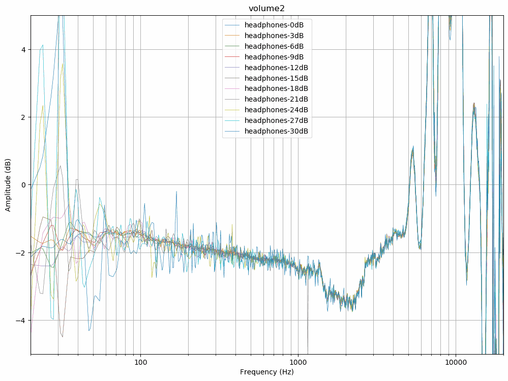
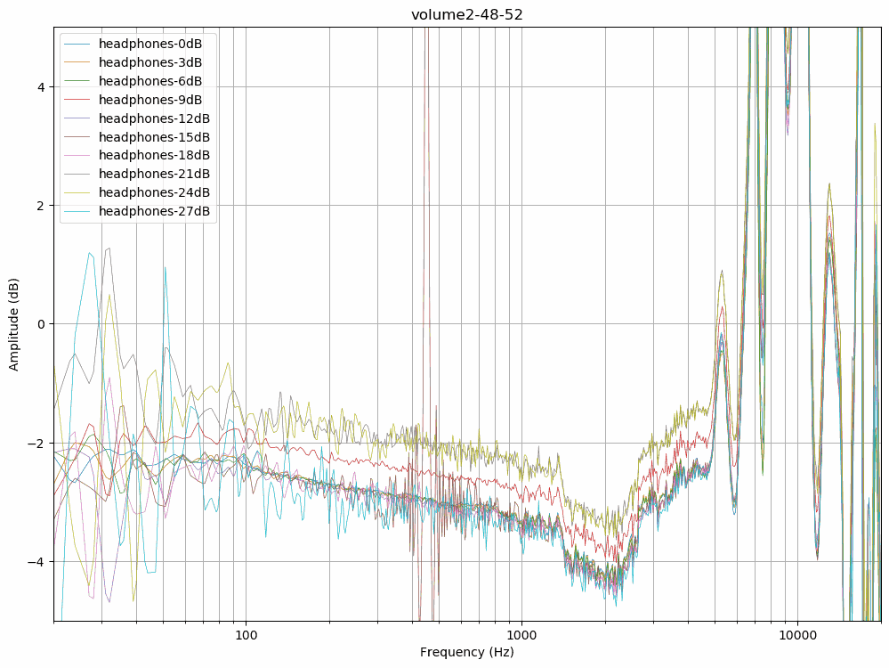
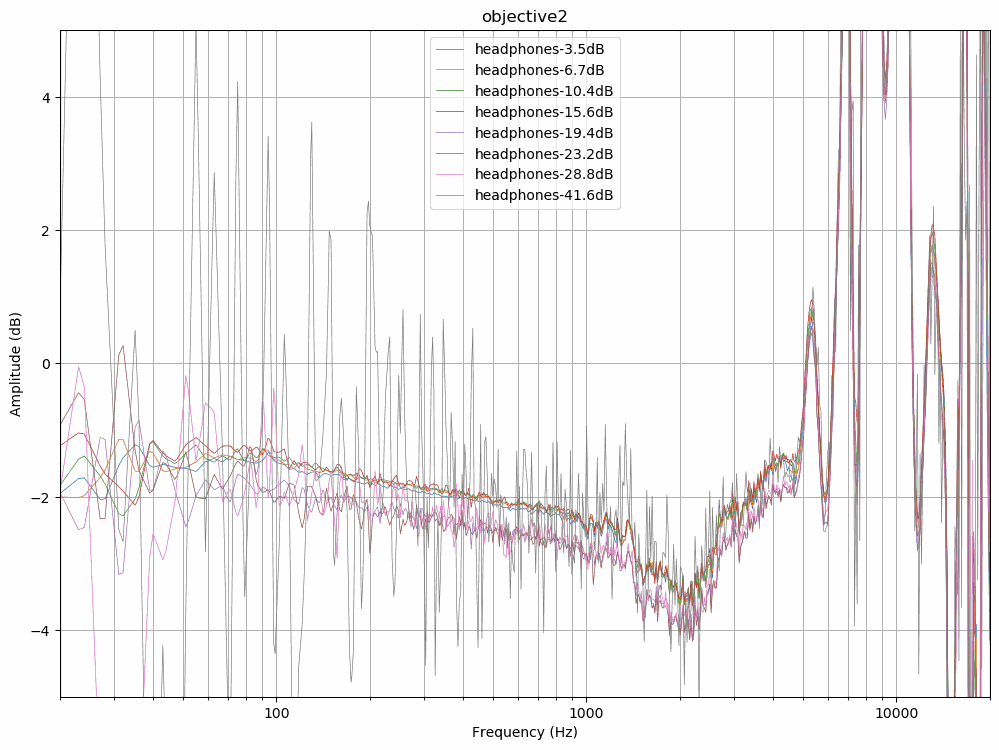
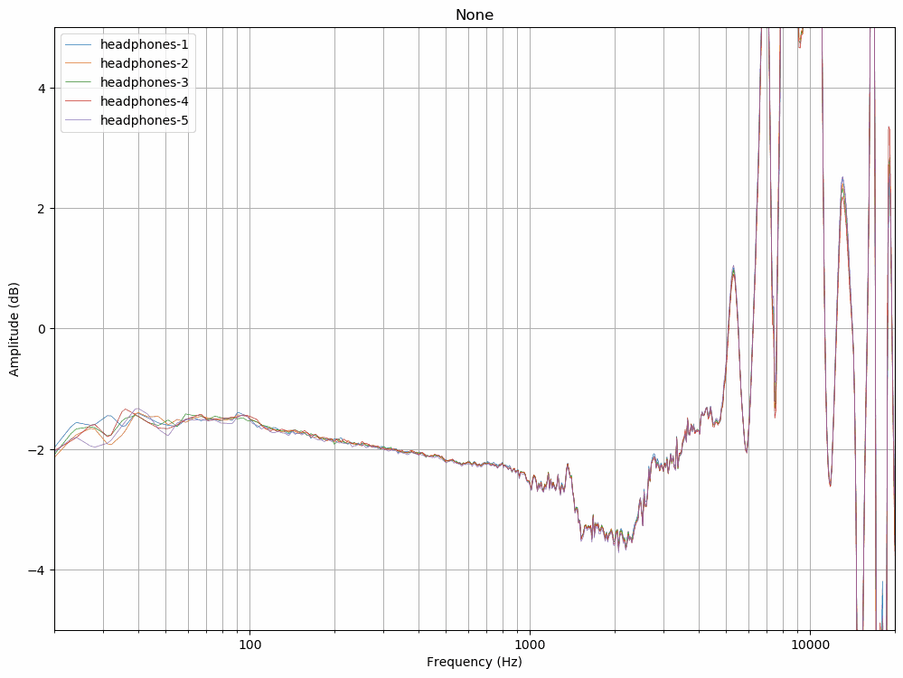

# Level VS Balance
This experiment investigates if level adjustment affects channel balance.

I noticed that controlling volume digitally with volume2 changes channel balance, at least perceptually. This should not
be possible but there is a possibility of a bug or glitch in the EqualizerAPO-Volume2-VirtualCable pipeline I'm using
for binaural rendering with HRIRs.

Headphone compensation measurements were made with multiple different volume levels and channel balance of each of them
are inspected to find out if the channel levels are adjusted equally when controlling level. Headphones used were
Sennheiser HD 800, binaural microphones The Sound Professionals SP-TFB-2, headphone amplifier and DAC ODAC+Objective2 by
Head'n'Hifi, operating system Windows 10 and extra audio processing pipeline used in the operating system was
EqualizerAPO with all filters disabled, VB Audio Virtual Cable for routing audio and Volume2 for volume control.

The graphs below are differences between left and right channel. In ideal case the curve would be exactly the same for
all iterations of the same setup. However the curve is not flat at zero because there are differences caused by ears,
headphone drivers and the microphones but the level difference between right and left channels should stay the same
when adjusting volume.

Most measurements show the volume relative to full scale ie `headphones-3dB` is a measurement where the volume has been
adjusted down by 3 dB. Last group doesn't have volume adjustment to establish a baseline so there the different
measurements are numbered with order number. Objective2 measurements have the headroom reported by `recorder.py`.

## Results
The channel balance issue observed was most likely caused by the 48/52 channel balance setting in Volume2 and the issue
in Volume2 which causes channel balance to change when adjusting volume when channel balance is not 50/50.

### volume2
"volume2" graph contains measurements where volume has been adjusted with volume2. Channel balance stays roughly the
same throughout the frequency spectrum except for a few measurements in the sub-bass region. Lower volume measurements
have more variance for some reason.

### volume2-48-52
"volume2-48-52" graph contains measurements done with volume2 but so that channel balance in volume2 options is
48/52. This shows that volume2 doesn't retain the same channel balance when adjusting volume.

### objective2
"objective2" graph contains measurements where volume has been adjusted with the analog volume adjustment of
Objective2 headphone amplifier. Operating system volume was at 0 dB. There are two groups where the first four with
headrooms between -3.5 dB and -15.6 dB are close to each other and the last four with head rooms between 19.4 dB and
41.6 dB are somewhat close to each other although the last measurement has a large variance.

## None
"None" graph contains measurements where volume has not been adjusted and has been at 0 dB for all measurements. This
is the baseline which shows the general repeatability of the measurement setup. Channel balance stays very similar
throughout all measurements.

